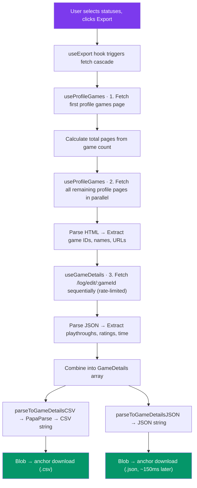

# Backloggd Plus — Content Script (`backloggd.content`)

> A WXT content script that injects a React-powered UI directly into the [Backloggd](https://backloggd.com) website, enabling authenticated users to export their game library, which includes ratings, time tracking, etc., as downloadable **CSV and JSON** files, optionally filtered by play status.

---

## Table of Contents

- [Business Logic Overview](#business-logic-overview)
- [Architecture](#architecture)
  - [Data Flow](#data-flow)
  - [Directory Structure](#directory-structure)
- [WXT Content Script Specifics](#wxt-content-script-specifics)
  - [Entry Point & Lifecycle](#entry-point--lifecycle)
  - [Shadow DOM & Style Isolation](#shadow-dom--style-isolation)
  - [Turbo-Aware Navigation Monitoring](#turbo-aware-navigation-monitoring)
- [Technical Stack](#technical-stack)
- [Development Standards](#development-standards)
  - [Path Aliases](#path-aliases)
  - [The Golden Rule: Import Boundaries](#the-golden-rule-import-boundaries)
  - [Feature Isolation](#feature-isolation)
- [State Management](#state-management)
- [API Layer](#api-layer)

---

## Business Logic Overview

The content script's core purpose is to **enhance the Backloggd website with features that the platform does not natively offer**. Currently, the primary feature is **Game Library Export**:

1. **Authentication Detection** — Reads the `#navbarDropdown` DOM element to determine if a user is logged in and extract their username.
2. **UI Injection** — Injects an export section into the **Settings → Data Management** page (`/settings/data/`) only, anchored to the data-management subtitle row and visually matching Backloggd's own styling.
3. **Status Filtering** — The user selects which play statuses (played, playing, backlog, wishlist) to include. The selection is persisted in `chrome.storage.local` (`local:statusFilters`) and shared with the extension popup.
4. **Data Scraping** — Fetches the user's paginated game library pages from Backloggd in parallel, by making HTTP requests and parsing the returned HTML with `DOMParser`.
5. **Detail Enrichment** — For each game discovered, fetches detailed log data (playthroughs, ratings, time played, statuses) from Backloggd's internal JSON API endpoint (`/log/edit/:gameId`). These requests are issued **sequentially and rate-limited** (one at a time) to avoid `429` responses.
6. **CSV & JSON Generation & Download** — Transforms the aggregated data into **both** a CSV (via PapaParse) and a JSON file, triggering two browser downloads (the JSON download is delayed ~150ms so the browser registers both). There is no format toggle; every run produces both files. Progress is surfaced through a phase-based lifecycle (`idle → analyzing → exporting → complete`, or `error`).

> **⚠️ Important:** The APIs consumed are **internal, undocumented Backloggd endpoints** and are subject to breakage at any time without notice. See [`shared/types/api.ts`](./shared/types/api.ts) for the full response type documentation.

---

## Architecture

### Data Flow



### Directory Structure

```
📦 backloggd.content/
┣ 📜 index.tsx          → WXT entry point: defineContentScript, Shadow Root, React mount
┣ 📜 App.tsx            → Root component: wraps features in QueryClient + Toaster providers
┣ 📜 style.css          → Tailwind + DaisyUI scoped to Shadow DOM (:host)
┃
┣ 📂 features/          → Feature modules (vertically sliced)
┃ ┗ 📂 export/          → Game Library Export feature
┃   ┣ 📂 api/           → React Query options factories, fetch functions, keys, pagination utils
┃   ┣ 📂 components/    → ExportSection, ExportDialog, ExportProgressIndicator
┃   ┣ 📂 hooks/         → useExport (orchestrator) + useProfileGames, useGameDetails (stages)
┃   ┣ 📂 utils/         → csv.ts, json.ts, download.ts
┃   ┗ 📜 types.ts       → Feature types (ExportPhase, ExportProgress, GameDetails, GameDetailsCSV, GameDetailsJSON)
┃
┣ 📂 lib/               → Third-party library configurations (scoped to content)
┃ ┣ 📜 axios.ts         → Axios instance with backloggd.com base URL + interceptors
┃ ┣ 📜 papaparse.ts     → CSV serialization wrapper
┃ ┗ 📜 react-query.ts   → QueryClient: stale time, gc time, refetch-on-focus/reconnect disabled
┃
┗ 📂 shared/            → Code shared across ALL features within content
  ┣ 📂 components/      → Dialog/ (Dialog, SettingsActionRow), DropdownButton
  ┣ 📂 providers/       → BackloggdToasterProvider — react-hot-toast, Backloggd-styled
  ┣ 📂 types/           → API response types + Axios module augmentation
  ┗ 📂 utils/           → url.ts (navigation detection), user.ts (auth detection)
```

---

## WXT Content Script Specifics

### Entry Point & Lifecycle

WXT uses **file-based routing**. The directory name `backloggd.content` tells WXT:

| Segment | Meaning |
|---------|---------|
| `backloggd` | The content script is registered to match `*://backloggd.com/*` and `*://*.backloggd.com/*` |
| `.content` | This is a **Content Script** entry point (as opposed to `.background` or a popup) |

The entry file [`index.tsx`](./index.tsx) exports a `defineContentScript()` call — a WXT auto-import that registers the script with the extension runtime. **This is the only file WXT reads to configure the entry point**; all other files are internal module imports.

**Execution World:** This content script runs in the browser's **Isolated World** by default. It shares the DOM with the host page but has a **separate JavaScript execution context**. This means:
- ✅ Access to `document.querySelector`, DOM APIs, and `window.location`
- ✅ Access to Chrome Extension APIs (`chrome.storage`, `chrome.runtime`)
- ❌ No access to page-level JavaScript variables or functions
- ❌ Page scripts cannot access the extension's variables

### Shadow DOM & Style Isolation

The UI is injected via WXT's `createShadowRootUi()` helper, which creates a [Shadow DOM](https://developer.mozilla.org/en-US/docs/Web/API/Web_components/Using_shadow_DOM) boundary:

```typescript
// index.tsx — anchored to the Settings → Data Management subtitle row
const ui = await createShadowRootUi(ctx, {
  anchor: dataManagementSubtitleRow,
  append: 'after',
  css,                              // Tailwind + DaisyUI, inlined as string
  name: INJECTED_ROOT_ELEMENT,      // <backloggd-plus-ui> custom element
  position: 'inline',
  onMount: (container) => {
    const root = createRoot(container);
    root.render(<App username={username} />);
    return root;
  },
  onRemove: (root) => root?.unmount(),
});
```

> **Provider placement:** The `QueryClientProvider` and `BackloggdToasterProvider` are no
> longer wired in `onMount`. They live inside [`App.tsx`](./App.tsx), which wraps the
> feature tree. `index.tsx` only renders `<App username={…} />`.

**Why Shadow DOM?**
- **Style Encapsulation** — Backloggd's CSS cannot leak into the extension UI, and the extension's Tailwind/DaisyUI classes cannot break the host page.
- **DOM Isolation** — The injected component tree lives inside a shadow root (`<backloggd-plus-ui>` custom element), keeping it invisible to Backloggd's own JavaScript and DOM queries.
- **CSS Strategy** — `style.css` is imported as a raw string (`?inline`) and passed into the Shadow Root. DaisyUI is configured with `root: ':host'` to scope its theme variables to the shadow boundary instead of `:root`.

### Turbo-Aware Navigation Monitoring

Backloggd uses [Hotwire Turbo](https://turbo.hotwired.dev/) for client-side navigation, which means the page doesn't fully reload on route changes. The content script handles re-injections by listening to `turbo:load` events.

The `ctx.isInvalid` check ensures the monitoring loop is cleaned up when the extension is disabled, updated, or unloaded; preventing orphaned listeners.

---

## Technical Stack

| Technology | Purpose | Location |
|------------|---------|----------|
| **WXT** | Extension framework — entry point routing, Shadow Root helpers, auto-imports, storage API | `index.tsx` |
| **React 19** | Component rendering inside Shadow DOM | `App.tsx`, `features/`, `shared/components/` |
| **React Query (TanStack)** | Server state management — caching, parallel queries, stale/refetch control (refetch-on-focus/reconnect disabled) | `lib/react-query.ts`, `features/export/api/` |
| **Axios** | HTTP client with response interceptors that unwrap `response.data` | `lib/axios.ts` |
| **PapaParse** | CSV serialization from JS objects | `lib/papaparse.ts` |
| **react-hot-toast** | Toast notifications, wrapped in a Backloggd-styled `BackloggdToasterProvider` | `shared/providers/` |
| **Tailwind CSS v4** | Utility-first styling (via Vite plugin) | `style.css` |
| **DaisyUI v5** | Component library (buttons, modals, dialogs) scoped to `:host` | `style.css` |
| **react-i18next** | Internationalization — `content` namespace for all content script strings | Components via `useTranslation()` |
| **clsx + tailwind-merge** | Conditional CSS class merging + Tailwind conflict resolution (via the `cn` helper) | `@globalShared/utils/cn` |

---

## Development Standards

### Path Aliases

Path aliases are defined **once** in the root **`tsconfig.json`** and consumed by both tools, so there is no second alias list to keep in sync:

1. **TypeScript** reads them directly for type checking and IDE autocomplete.
2. **Vite (build time)** reads the same `tsconfig.json` paths through the `vite-tsconfig-paths` plugin registered in **`wxt.config.ts`** (the previous manual `resolve.alias` block is no longer needed).

| Alias | Resolves To | Architectural Purpose | Example |
|-------|-------------|----------------------|---------|
| `@content/*` | `./entrypoints/backloggd.content/*` | Content script internal imports — avoids deep relative paths within the content script | `import { api } from '@content/lib/axios'` |
| `@popup/*` | `./entrypoints/popup/*` | Popup entry point imports | `import { Settings } from '@popup/components/Settings'` |
| `@background/*` | `./entrypoints/background/*` | Background service worker imports | `import { handler } from '@background/handlers/export'` |
| `@globalShared/*` | `./entrypoints/shared/*` | Cross-entrypoint shared code (i18n, storage definitions) | `import i18n from '@globalShared/i18n'` |

**Usage within the content script:**

```typescript
// ✅ CORRECT — Using alias for cross-module imports within content
import { api } from '@content/lib/axios';
import { ProfileGamesPageScrapeResponse } from '@content/shared/types/api';

// ✅ CORRECT — Using alias for cross-entrypoint shared code
import i18n from '@globalShared/i18n';
import { filtersStorageItem } from '@globalShared/storage';

// ✅ CORRECT — Relative imports for same-feature sibling files
import { queryKeys } from './keys';

// ❌ WRONG — Deep relative path that should use an alias
import { api } from '../../../lib/axios';
```

> **Note:** The root `tsconfig.json` defines all aliases globally to centralize alias definitions and keep the configuration DRY while each entry point prefix (`@content/`, `@popup/`, `@background/`) naturally prevents naming collisions.

---

### The Golden Rule: Import Boundaries

> **🚫 Never import code from one entry point into another.**

ESLint enforces strict import boundaries via the `import/no-restricted-paths` rule, configured in [`eslint.constants.ts`](../../eslint.constants.ts):

```
 ┌────────────────┐    ┌────────────────┐    ┌────────────────┐
 │   background   │ ✖─ │    content    │ ─✖ │     popup      │
 └───────┬────────┘    └───────┬────────┘    └───────┬────────┘
         │                     │                     │
         │     ┌───────────────┴──────────────┐      │
         └─────►    entrypoints/shared/       ◄──────┘
               │  (i18n, storage — allowed)   │
               └──────────────────────────────┘
```

**The rules:**

| Rule | Scope | What's Blocked | What's Allowed |
|------|-------|----------------|----------------|
| **Entry Point Isolation** | Each entry point (`content`, `popup`, `background`) | Importing from any *other* entry point's directory | Importing from own directory + `entrypoints/shared/` |
| **Feature Isolation** | Each feature inside `content/features/` | Importing from any *other* feature's directory | Importing from own feature directory only |
| **Shared Protection** | `entrypoints/shared/` | Importing from any entry point | Importing from its own `shared/` directory |

**Why this matters — Technical Risks:**

1. **Bundle Bloat** — Each entry point (content, popup, background) is bundled **separately** by WXT/Vite. Importing popup code into the content script would pull the entire popup dependency tree into the content script bundle, dramatically increasing its size and load time on every page.

2. **Runtime Errors in Isolated Worlds** — Content scripts run in the browser's **Isolated World**, which does not have access to extension-specific APIs available only in the popup context (`chrome.action`) or background context (`chrome.webNavigation`, certain `chrome.tabs` overloads). Code that works in one context may throw `TypeError: chrome.action is undefined` at runtime in another.

3. **Lifecycle Mismatch** — A content script is created and destroyed per-tab and per-navigation. The background service worker is a long-lived singleton. The popup is ephemeral — created on click, destroyed on close. Sharing code between these contexts creates subtle state management bugs and memory leaks.

**ESLint zone configuration:**

```typescript
// eslint.constants.ts — Simplified view
const entrypointImportRestrictions = entrypoints.map((entrypoint) => ({
  target: `entrypoints/${entrypoint}`,          // Files IN this entry point...
  from: 'entrypoints',                          // ...cannot import from entrypoints/...
  except: [`./${entrypoint}`, './shared'],       // ...except their own dir and shared.
}));

const featureImportRestrictions = features.map((feature) => ({
  target: `entrypoints/backloggd.content/features/${feature}`,
  from: 'entrypoints/backloggd.content/features',
  except: [`./${feature}`],                      // Each feature can only import itself.
}));
```

---

### Feature Isolation

Features follow a **vertical slice architecture**. Each feature under `features/` is a self-contained module with its own `api/`, `components/`, `hooks/`, `utils/`, and `types.ts`:

```
features/
└── export/          ← One feature = one vertical slice
    ├── api/         ← React Query options + fetch functions
    ├── components/  ← UI components specific to this feature
    ├── hooks/       ← Custom hooks orchestrating feature logic
    ├── utils/       ← Feature-specific utility functions
    └── types.ts     ← Feature-specific type definitions
```

**Sharing between features:** If two features need the same code, it must be lifted to `shared/` (content-level) or `lib/` — never imported across feature boundaries.

---

## State Management

The content script uses a **layered state management** approach:

| Layer | Tool | Purpose | Example |
|-------|------|---------|---------|
| **Server State** | React Query (`useQuery`, `useQueries`) | API responses, caching, stale management, parallel fetching | `useExport` hook — cascading queries |
| **Local UI State** | React `useState` | Component-level toggles (dialog open, export triggered) | `ExportSection` — dialog open, `ExportDialog` — `isExportTriggered` |
| **Persistent State** | WXT `storage` API + `useStatusFilters` hook | Cross-context values persisted in `chrome.storage.local` | `filtersStorageItem` (`local:statusFilters`) — popup ↔ content sync |

The `useExport` hook demonstrates the **cascading query pattern**: it composes `useProfileGames` (stages 1–2) and `useGameDetails` (stage 3), where each stage enables the next only after the previous settles successfully, avoiding race conditions and unnecessary fetches. Individual game-detail failures are tolerated so a single broken game does not abort the whole export.

---

## API Layer

The API layer uses a **custom Axios instance** with Backloggd-specific configuration:

- **Base URL:** `https://backloggd.com`
- **Response Interceptor:** Unwraps `response.data` automatically — callers receive the response body directly instead of the full `AxiosResponse` wrapper.
- **Error Interceptor:** Normalizes all errors (Axios errors, generic errors, unknown) into a consistent `{ message, status, url }` shape.
- **Type Augmentation:** [`axios.d.ts`](./shared/types/axios.d.ts) overrides Axios's generic method signatures so that `api.get<T>(url)` returns `Promise<T>` directly (matching the unwrapped interceptor behavior).

```typescript
// Usage — the return type is GameLogDetailsResponse, not AxiosResponse<GameLogDetailsResponse>
const details = await api.get<GameLogDetailsResponse>(`/log/edit/${gameId}`);
```
